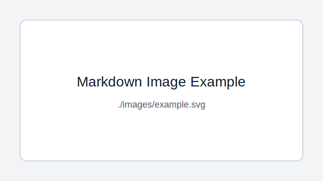

# 06. Markdown Preview Guide

`README.md` 같은 `.md` 파일은 Markdown 문서입니다.

이 수업의 설명서, 실습 안내, 과제 제출 문서, 발표 자료 초안은 대부분 Markdown으로 작성되어 있습니다. 코드를 실행하기 전에 먼저 README를 Preview로 읽고, 프로젝트를 진행하면서 직접 Markdown 문서를 작성할 수 있어야 합니다.

## 1. Markdown이란?

Markdown은 문서를 간단한 기호로 작성하는 방식입니다.

예를 들어 아래처럼 작성합니다.

```markdown
# 큰 제목
## 중간 제목
- 목록 1
- 목록 2
```

VS Code Preview로 보면 제목, 목록, 코드블록이 보기 좋게 표시됩니다.

Markdown의 장점은 다음과 같습니다.

- 문법이 단순합니다.
- README, 과제, 보고서 작성에 적합합니다.
- GitHub에서 보기 좋게 표시됩니다.
- 코드와 설명을 함께 정리하기 좋습니다.
- PDF로 변환해서 제출하기 쉽습니다.

## 2. README.md 열기

VS Code Explorer에서 `README.md` 파일을 클릭합니다.

처음에는 원본 텍스트가 보입니다. 원본 텍스트에는 `#`, `-`, ``` 같은 기호가 보일 수 있습니다. 이것이 Markdown 문법입니다.

## 3. Preview 열기

기본 Preview 열기:

```text
Ctrl + Shift + V
```

옆에 Preview 열기:

```text
Ctrl + K, V
```

`Ctrl + K`를 먼저 누른 뒤 손을 떼고 `V`를 누릅니다.

VS Code 오른쪽 위의 Preview 아이콘을 클릭해도 Preview가 열립니다.

## 4. Markdown 파일 새로 만들기

Markdown 파일은 확장자가 `.md`입니다.

예시 파일명:

```text
README.md
project-plan.md
test-checklist.md
final-presentation.md
```

새 파일을 만들 때는 파일 이름 끝에 `.md`를 붙입니다.

예시:

```text
my-note.md
```

## 5. 제목 작성하기

제목은 `#` 기호로 작성합니다.

```markdown
# 1단계 큰 제목
## 2단계 중간 제목
### 3단계 작은 제목
#### 4단계 더 작은 제목
```

Preview에서는 아래처럼 계층이 나뉘어 보입니다.

```text
1단계 큰 제목
 2단계 중간 제목
 3단계 작은 제목
 4단계 더 작은 제목
```

수업 문서를 작성할 때는 보통 `#`, `##`, `###` 정도만 사용해도 충분합니다.

좋은 예:

```markdown
# 프로젝트 개요

## 1. 문제 정의

## 2. 해결 방법

## 3. 실행 결과
```

## 6. 문단 작성하기

일반 문장은 그냥 입력하면 됩니다.

```markdown
이 프로젝트는 기술 지원 문의를 자동으로 분류하고 답변 초안을 생성하는 AI 워크플로우입니다.
```

문단을 나누려면 한 줄을 비웁니다.

```markdown
첫 번째 문단입니다.

두 번째 문단입니다.
```

## 7. 목록 작성하기

순서가 없는 목록은 `-`를 사용합니다.

```markdown
- Python 설치
- VS Code 설치
- 가상환경 만들기
- 패키지 설치
```

순서가 있는 목록은 숫자를 사용합니다.

```markdown
1. README.md를 연다.
2. Preview로 읽는다.
3. 터미널을 연다.
4. 명령어를 실행한다.
```

목록은 수업 절차, 체크 항목, 기능 목록을 정리할 때 자주 사용합니다.

## 8. 체크리스트 작성하기

체크리스트는 과제 제출 전 확인용으로 많이 사용합니다.

```markdown
- [ ] Python 설치 확인
- [ ] VS Code 설치 확인
- [ ].venv 생성
- [ ] requirements.txt 설치
- [ ] README Preview 확인
```

완료한 항목은 `[x]`로 표시할 수 있습니다.

```markdown
- [x] Python 설치 확인
- [ ] VS Code 설치 확인
```

## 9. 코드블록 작성하기

명령어와 코드는 코드블록으로 작성합니다.

코드블록은 백틱 3개로 시작하고 백틱 3개로 끝납니다.

````markdown
```powershell
python --version
```
````

PowerShell 명령어 예시:

```powershell
cd C:\aidev\02_supabase-ai-backend
python -m venv .venv
.\.venv\Scripts\Activate.ps1
pip install -r requirements.txt
```

Python 코드 예시:

```python
name = "student"
print(f"Hello, {name}")
```

코드블록 위에는 어떤 언어인지 적어 주면 Preview에서 더 보기 좋게 표시됩니다.

자주 쓰는 언어 이름:

```text
powershell
python
json
text
markdown
sql
yaml
```

## 10. 인라인 코드 작성하기

문장 안에서 파일명, 명령어, 변수명, 폴더명을 강조할 때는 백틱 1개를 사용합니다.

```markdown
`README.md` 파일을 열고 `Ctrl + Shift + V`를 누릅니다.
```

Preview에서는 `README.md`처럼 보입니다.

수업 문서에서는 아래와 같은 항목에 인라인 코드를 자주 사용합니다.

- `README.md`
- `.venv`
- `requirements.txt`
- `pip install`
- `uvicorn`
- `streamlit`

## 11. 표 작성하기

표는 비교나 정리에 좋습니다.

```markdown
| 항목 | 설명 |
| --- | --- |
| Python | 프로그래밍 언어 |
| VS Code | 코드 편집기 |
|.venv | 프로젝트별 가상환경 |
```

Preview에서는 표 형태로 보입니다.

수업 문서 예시:

```markdown
| 단계 | 작업 | 명령어 |
| --- | --- | --- |
| 1 | 폴더 이동 | `cd C:\aidev\02_supabase-ai-backend` |
| 2 | 가상환경 생성 | `python -m venv .venv` |
| 3 | 가상환경 활성화 | `.\.venv\Scripts\Activate.ps1` |
```

표를 작성할 때 주의할 점:

- 첫 줄은 열 제목입니다.
- 둘째 줄에는 `---`를 넣습니다.
- 각 칸은 `|`로 구분합니다.

## 12. 굵게, 기울임, 취소선

중요한 단어는 굵게 표시할 수 있습니다.

```markdown
**중요한 내용**
```

기울임:

```markdown
*강조하고 싶은 내용*
```

취소선:

```markdown
~~삭제된 내용~~
```

수업 문서에서는 너무 많이 꾸미기보다 중요한 경고나 핵심 단어에만 사용하는 것이 좋습니다.

## 13. 링크 작성하기

링크는 아래 형식으로 작성합니다.

```markdown
[보이는 글자](https://example.com)
```

예시:

```markdown
[Python 공식 사이트](https://www.python.org/)
```

다른 문서로 이동하는 링크도 만들 수 있습니다.

```markdown
[가상환경 안내](05_venv-and-pip-guide.md)
```

Preview 화면에서는 링크를 클릭할 수 있습니다.

## 14. 이미지 넣기

이미지는 아래 형식으로 작성합니다.

```markdown

```

예시:

```markdown

```

이미지를 넣을 때는 이미지 파일 경로가 정확해야 합니다.

권장 구조:

```text
project-folder/
 README.md
 images/
 screen-01.png
```

그리고 README에는 아래처럼 작성합니다.

```markdown

```

## 15. 인용문 작성하기

인용문이나 주의사항은 `>`로 작성할 수 있습니다.

```markdown
> 주의: `.env` 파일은 GitHub에 올리지 않습니다.
```

수업 문서에서는 주의사항, 팁, 진행자 메모에 사용할 수 있습니다.

## 16. 구분선 작성하기

내용을 나누고 싶을 때 구분선을 사용할 수 있습니다.

```markdown
---
```

하지만 너무 많이 사용하면 문서가 복잡해 보일 수 있습니다. 큰 단락을 나눌 때만 사용합니다.

## 17. 과제 문서 기본 템플릿

과제나 실습 결과를 제출할 때는 아래 형식을 사용할 수 있습니다.

````markdown
# 과제 제목

## 1. 실습 목표

이번 실습의 목표를 작성합니다.

## 2. 사용한 도구

- Python
- VS Code
- FastAPI

## 3. 실행 방법

```powershell
python main.py
```

## 4. 실행 결과

실행 결과를 글이나 이미지로 정리합니다.

## 5. 오류와 해결

발생한 오류와 해결 방법을 작성합니다.

## 6. 느낀 점

실습을 통해 배운 점을 작성합니다.
````

위 템플릿 안에 코드블록이 들어 있으므로, 실제 문서에 붙여 넣을 때는 코드블록 시작과 끝이 맞는지 확인합니다.

## 18. 프로젝트 README 기본 템플릿

팀 프로젝트 README는 아래 구조를 권장합니다.

````markdown
# 프로젝트 이름

## 1. 프로젝트 소개

이 프로젝트가 무엇을 하는지 작성합니다.

## 2. 주요 기능

- 기능 1
- 기능 2
- 기능 3

## 3. 폴더 구조

```text
project/
 backend/
 frontend/
 docs/
 README.md
```

## 4. 설치 방법

```powershell
python -m venv .venv
.\.venv\Scripts\Activate.ps1
pip install -r requirements.txt
```

## 5. 실행 방법

```powershell
uvicorn main:app --reload
```

## 6. 테스트 방법

어떻게 테스트했는지 작성합니다.

## 7. 참고 자료

- 참고 문서 1
- 참고 문서 2
````

## 19. Markdown 작성 시 자주 하는 실수

### 제목 기호 뒤에 공백이 없음

잘못된 예:

```markdown
#제목
```

좋은 예:

```markdown
# 제목
```

### 코드블록을 닫지 않음

코드블록은 시작과 끝이 모두 있어야 합니다.

````markdown
```powershell
python --version
```
````

### 표의 두 번째 줄을 빠뜨림

잘못된 예:

```markdown
| 항목 | 설명 |
| Python | 언어 |
```

좋은 예:

```markdown
| 항목 | 설명 |
| --- | --- |
| Python | 언어 |
```

### 이미지 경로가 틀림

이미지가 보이지 않으면 파일 위치와 경로를 확인합니다.

```markdown

```

## 20. Preview로 확인하는 습관

Markdown 문서를 작성한 뒤에는 항상 Preview로 확인합니다.

확인 순서:

```text
1. 문서를 저장한다.
2. Ctrl + Shift + V로 Preview를 연다.
3. 제목이 잘 보이는지 확인한다.
4. 표가 깨지지 않았는지 확인한다.
5. 코드블록이 제대로 닫혔는지 확인한다.
6. 링크와 이미지가 정상인지 확인한다.
```

## 21. PDF로 제출할 때

Markdown 문서를 PDF로 제출해야 한다면 `Markdown PDF` 확장을 사용할 수 있습니다.

사용 방법:

```text
Markdown 파일 열기
-> 마우스 오른쪽 클릭
-> Markdown PDF: Export (pdf)
```

자세한 설치 방법은 아래 문서를 참고합니다.

```text
03_vscode-extensions-guide.md
```

## 22. 수업 중 사용 원칙

```text
1. README.md를 먼저 연다.
2. Preview로 읽는다.
3. 명령어는 코드블록에서 확인한다.
4. 코드블록 전체를 무작정 붙여넣기보다 한 단계씩 실행한다.
5. 실습 결과는 Markdown 문서로 정리한다.
6. 제출 전 Preview와 PDF를 모두 확인한다.
```

## 23. 최종 체크리스트

아래 항목을 확인합니다.

```text
[ ].md 파일을 만들 수 있다.
[ ] 제목을 작성할 수 있다.
[ ] 목록을 작성할 수 있다.
[ ] 체크리스트를 작성할 수 있다.
[ ] 코드블록을 작성할 수 있다.
[ ] 표를 작성할 수 있다.
[ ] 링크를 작성할 수 있다.
[ ] 이미지를 넣을 수 있다.
[ ] Preview로 문서를 확인할 수 있다.
[ ] Markdown 문서를 PDF로 변환할 수 있다.
```
